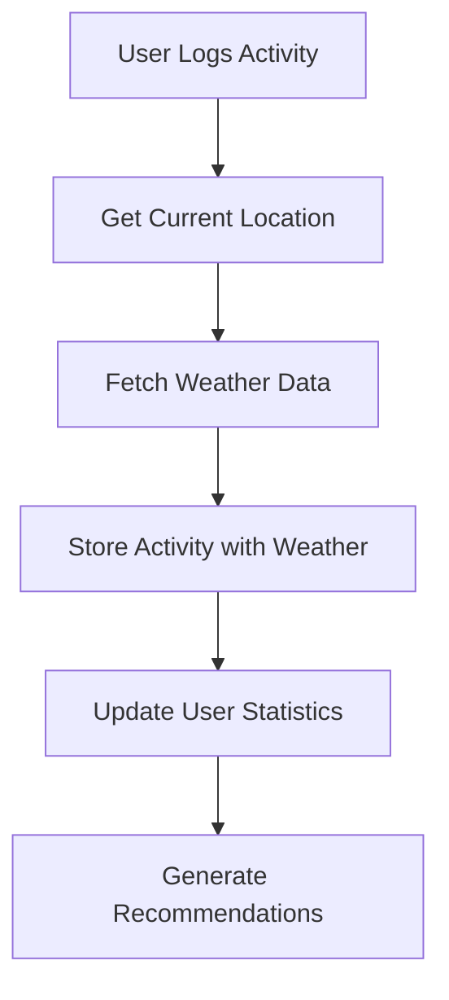

# Activity Tracker Documentation

## 📋 Table of Contents
- [Overview](#overview)
- [Features](#features)
- [API Endpoints](#api-endpoints)
- [Database Schema](#database-schema)
- [Frontend Components](#frontend-components)
- [Usage Examples](#usage-examples)
- [Integration with Weather Data](#integration-with-weather-data)
- [Analytics and Insights](#analytics-and-insights)
- [Best Practices](#best-practices)

## 🎯 Overview

The **Activity Tracker** is a comprehensive feature within the ClimAware Portal that enables users to log, monitor, and analyze their daily activities in correlation with weather and climate conditions. It provides personalized insights and recommendations to help users make informed decisions about their activities based on weather forecasts.

### Key Objectives
- Track user activities with weather context
- Provide personalized weather-based recommendations
- Analyze activity patterns and climate correlations
- Enhance user climate awareness through data-driven insights
- Support better activity planning and safety

## 🚀 Features

### 1. Activity Logging
- **Manual Entry**: Users can manually log activities with detailed information
- **Real-time Weather Capture**: Automatically records weather conditions during activity logging
- **Flexible Categorization**: Support for multiple activity types and custom categories
- **Rich Metadata**: Includes location, duration, notes, and weather context

### 2. Weather Integration
- **Automatic Weather Fetching**: Retrieves current weather data when activities are logged
- **Historical Weather Storage**: Maintains weather context for past activities
- **Multi-parameter Tracking**: Temperature, humidity, wind speed, pressure, and conditions
- **Location-based Data**: Weather data specific to activity location

### 3. Smart Analytics
- **Pattern Recognition**: Identifies user preferences based on weather conditions
- **Performance Correlation**: Links activity success with weather parameters
- **Trend Analysis**: Shows activity frequency changes with seasons/weather
- **Climate Score Calculation**: Quantifies user's climate awareness and adaptation

### 4. Personalized Recommendations
- **Weather-based Suggestions**: Recommends activities based on upcoming weather
- **Safety Alerts**: Warns about unsuitable conditions for planned activities
- **Optimal Timing**: Suggests best times for specific activities
- **Alternative Activities**: Proposes indoor alternatives during adverse weather

## 🔌 API Endpoints

### Activity Management

#### Get User Activities
```http
GET /api/users/activities
Authorization: Bearer <token>
```

**Response:**
```json
[
  {
    "_id": "activity_id",
    "userId": "user_id",
    "name": "Morning Jog",
    "type": "outdoor",
    "date": "2024-01-15T06:00:00.000Z",
    "location": "Dar es Salaam",
    "notes": "Great weather for running",
    "weather": {
      "temperature": 24.5,
      "description": "clear sky",
      "humidity": 65,
      "windSpeed": 3.2,
      "pressure": 1013
    },
    "createdAt": "2024-01-15T06:30:00.000Z"
  }
]
```

#### Add New Activity
```http
POST /api/users/activities
Authorization: Bearer <token>
Content-Type: application/json
```

**Request Body:**
```json
{
  "name": "Beach Volleyball",
  "type": "sports",
  "date": "2024-01-15T16:00:00.000Z",
  "location": "Dar es Salaam",
  "notes": "Fun game with friends"
}
```

**Response:**
```json
{
  "_id": "new_activity_id",
  "userId": "user_id",
  "name": "Beach Volleyball",
  "type": "sports",
  "date": "2024-01-15T16:00:00.000Z",
  "location": "Dar es Salaam",
  "notes": "Fun game with friends",
  "weather": {
    "temperature": 28.3,
    "description": "partly cloudy",
    "humidity": 72,
    "windSpeed": 4.1,
    "pressure": 1012
  },
  "createdAt": "2024-01-15T16:15:00.000Z"
}
```

#### Delete Activity
```http
DELETE /api/users/activities/:activityId
Authorization: Bearer <token>
```

### Analytics Endpoints

#### Get User Statistics
```http
GET /api/users/stats
Authorization: Bearer <token>
```

**Response:**
```json
{
  "totalActivities": 25,
  "outdoorActivities": 18,
  "indoorActivities": 7,
  "avgTemperature": 26,
  "totalComments": 12,
  "publicComments": 8,
  "climateScore": 85,
  "activityBreakdown": [
    { "_id": "outdoor", "count": 18 },
    { "_id": "indoor", "count": 7 }
  ],
  "recentActivities": [
    {
      "_id": "activity_id",
      "name": "Morning Jog",
      "type": "outdoor",
      "date": "2024-01-15T06:00:00.000Z",
      "weather": { "temperature": 24.5 }
    }
  ]
}
```

## 🗄️ Database Schema

### Activity Model
```javascript
const activitySchema = new mongoose.Schema({
    userId: {
        type: mongoose.Schema.Types.ObjectId,
        ref: 'User',
        required: true
    },
    name: {
        type: String,
        required: true,
        trim: true
    },
    type: {
        type: String,
        enum: ['outdoor', 'indoor', 'sports', 'travel', 'work'],
        required: true
    },
    date: {
        type: Date,
        required: true
    },
    weather: {
        temperature: Number,
        description: String,
        humidity: Number,
        windSpeed: Number,
        pressure: Number
    },
    location: {
        type: String,
        default: 'Dar es Salaam'
    },
    notes: {
        type: String,
        trim: true
    }
}, {
    timestamps: true
});
```

### Indexes
```javascript
// Efficient querying by user and date
activitySchema.index({ userId: 1, date: -1 });

// Activity type analysis
activitySchema.index({ userId: 1, type: 1 });

// Weather correlation queries
activitySchema.index({ userId: 1, 'weather.temperature': 1 });
```

## 🎨 Frontend Components

### Activity Form Component
```html
<div class="activity-form">
    <input type="text" id="activityName" placeholder="Activity name" class="form-input">
    <select id="activityType" class="form-select">
        <option value="outdoor">Outdoor</option>
        <option value="indoor">Indoor</option>
        <option value="sports">Sports</option>
        <option value="travel">Travel</option>
        <option value="work">Work</option>
    </select>
    <input type="datetime-local" id="activityDate" class="form-input">
    <button onclick="addActivity()" class="add-btn">Add</button>
</div>
```

### Activity List Component
```html
<div class="activity-list" id="activityList">
    <div class="activity-item">
        <div class="activity-info">
            <div class="activity-name">Morning Jog</div>
            <div class="activity-details">
                outdoor • 1/15/2024 • 24°C
            </div>
        </div>
        <button onclick="deleteActivity(index)" class="delete-btn">Delete</button>
    </div>
</div>
```

### Statistics Dashboard
```html
<div class="stats-grid">
    <div class="stat-item">
        <div class="stat-value" id="totalActivities">25</div>
        <div class="stat-label">Activities</div>
    </div>
    <div class="stat-item">
        <div class="stat-value" id="outdoorActivities">18</div>
        <div class="stat-label">Outdoor</div>
    </div>
    <div class="stat-item">
        <div class="stat-value" id="avgTemp">26°C</div>
        <div class="stat-label">Avg Temp</div>
    </div>
    <div class="stat-item">
        <div class="stat-value" id="climateScore">85</div>
        <div class="stat-label">Climate Score</div>
    </div>
</div>
```

## 📝 Usage Examples

### 1. Logging an Outdoor Activity
```javascript
async function addActivity() {
    const activity = {
        name: 'Morning Jog',
        type: 'outdoor',
        date: new Date().toISOString(),
        notes: 'Perfect weather for running'
    };

    const response = await fetch('/api/users/activities', {
        method: 'POST',
        headers: {
            'Content-Type': 'application/json',
            'Authorization': `Bearer ${token}`
        },
        body: JSON.stringify(activity)
    });

    const savedActivity = await response.json();
    console.log('Activity saved with weather:', savedActivity.weather);
}
```

### 2. Analyzing Activity Patterns
```javascript
async function analyzeActivityPatterns() {
    const stats = await fetch('/api/users/stats', {
        headers: { 'Authorization': `Bearer ${token}` }
    }).then(res => res.json());

    console.log(`Outdoor activities: ${stats.outdoorActivities}`);
    console.log(`Average temperature: ${stats.avgTemperature}°C`);
    console.log(`Climate score: ${stats.climateScore}`);
}
```

### 3. Weather-based Recommendations
```javascript
function generateRecommendations(weatherForecast, userActivities) {
    const outdoorActivities = userActivities.filter(a => a.type === 'outdoor');
    const preferredTemp = calculateAverageTemp(outdoorActivities);
    
    if (weatherForecast.temperature >= preferredTemp - 5 && 
        weatherForecast.temperature <= preferredTemp + 5) {
        return "Perfect weather for your usual outdoor activities!";
    } else if (weatherForecast.description.includes('rain')) {
        return "Rainy day - consider indoor alternatives.";
    }
    
    return "Check conditions before outdoor activities.";
}
```

## 🌤️ Integration with Weather Data

### Weather Data Sources
- **Primary**: OpenWeatherMap API
- **Backup**: Local weather service APIs
- **Historical**: Stored weather data from past activities

### Weather Parameters Tracked
| Parameter | Description | Unit | Usage |
|-----------|-------------|------|-------|
| Temperature | Air temperature | °C | Activity comfort analysis |
| Humidity | Relative humidity | % | Heat index calculations |
| Wind Speed | Wind velocity | m/s | Outdoor activity safety |
| Pressure | Atmospheric pressure | hPa | Weather pattern analysis |
| Conditions | Weather description | String | Activity recommendations |

### Weather Integration Flow


## 📊 Analytics and Insights

### Climate Score Calculation
```javascript
function calculateClimateScore(userStats) {
    const baseScore = 0;
    const outdoorBonus = userStats.outdoorActivities * 10;
    const commentBonus = userStats.totalComments * 5;
    const publicCommentBonus = userStats.publicComments * 3;
    
    return Math.min(100, baseScore + outdoorBonus + commentBonus + publicCommentBonus);
}
```

### Activity Pattern Analysis
- **Seasonal Trends**: Activity frequency by season
- **Weather Preferences**: Optimal conditions for each activity type
- **Performance Metrics**: Success rate vs weather conditions
- **Safety Analysis**: Risk assessment based on weather patterns

### Recommendation Engine
```javascript
class ActivityRecommendationEngine {
    constructor(userActivities, weatherForecast) {
        this.activities = userActivities;
        this.forecast = weatherForecast;
    }
    
    generateRecommendations() {
        const recommendations = [];
        
        // Analyze user preferences
        const preferences = this.analyzePreferences();
        
        // Match with forecast
        for (const day of this.forecast) {
            const suggestion = this.matchWeatherToActivity(day, preferences);
            recommendations.push(suggestion);
        }
        
        return recommendations;
    }
    
    analyzePreferences() {
        // Analyze user's activity patterns and weather preferences
        return {
            preferredTemperature: this.calculateAverageTemp(),
            favoriteActivities: this.getMostFrequentActivities(),
            weatherTolerance: this.calculateWeatherTolerance()
        };
    }
}
```

## 🎯 Best Practices

### Data Collection
- **Consistent Logging**: Encourage regular activity logging
- **Accurate Timestamps**: Use precise date/time for weather correlation
- **Location Awareness**: Include location for accurate weather data
- **Rich Context**: Add notes and details for better insights

### Privacy and Security
- **Data Encryption**: Encrypt sensitive activity data
- **User Consent**: Clear consent for weather data collection
- **Data Retention**: Implement appropriate data retention policies
- **Access Control**: Secure API endpoints with proper authentication

### Performance Optimization
- **Efficient Queries**: Use database indexes for fast retrieval
- **Caching**: Cache weather data to reduce API calls
- **Pagination**: Implement pagination for large activity lists
- **Background Processing**: Process analytics in background jobs

### User Experience
- **Intuitive Interface**: Simple and clear activity logging forms
- **Visual Feedback**: Show weather context in activity displays
- **Smart Defaults**: Pre-fill common values (location, time)
- **Offline Support**: Allow offline logging with sync capabilities

## 🔮 Future Enhancements

### Planned Features
- **AI-Powered Predictions**: Machine learning for activity recommendations
- **Social Features**: Share activities and compare with friends
- **Wearable Integration**: Sync with fitness trackers and smartwatches
- **Advanced Analytics**: Detailed performance and health correlations
- **Gamification**: Achievements and challenges based on climate awareness

### Technical Improvements
- **Real-time Updates**: Live weather updates during activities
- **Geolocation Services**: Automatic location detection
- **Offline Capabilities**: Full offline functionality with sync
- **API Expansion**: Additional weather data sources and parameters

---

## 📞 Support and Contribution

For questions, issues, or contributions to the Activity Tracker feature:

- **Documentation**: This file and inline code comments
- **API Testing**: Use the provided test scripts in `/backend/test_dashboard.js`
- **Frontend Testing**: Access the dashboard at `/user.html`
- **Database**: MongoDB collections: `activities`, `users`, `comments`

---

*Last Updated: January 2024*
*Version: 1.0.0*